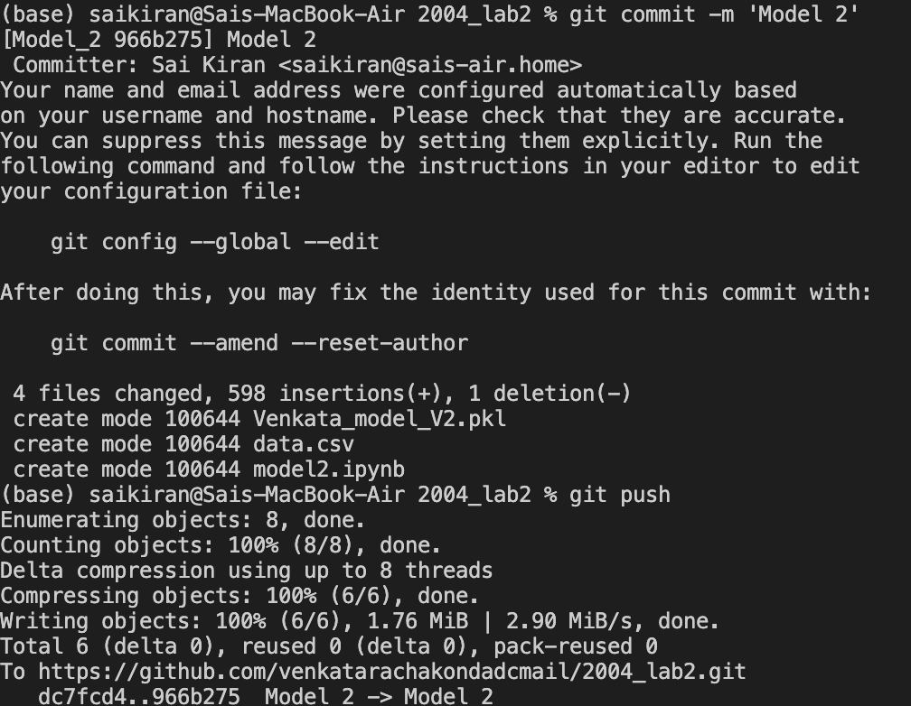
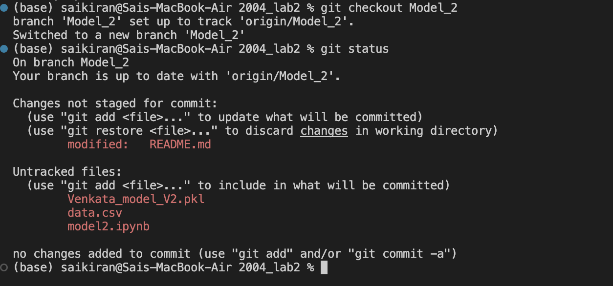

# lab2_2004
# Breast Cancer Prediction using Machine Learning

## Introduction
Breast cancer is a critical health issue affecting women worldwide. Early detection and accurate prediction of breast cancer can significantly improve treatment outcomes. This project aims to develop a machine learning model for breast cancer prediction based on relevant clinical features.

## Dataset
The dataset used for this project is the Breast Cancer Wisconsin (Diagnostic) Dataset, which contains various clinical features extracted from digitized images of breast mass. The dataset consists of a collection of patient records with corresponding diagnosis labels indicating whether the mass is benign or malignant.

## Data Preprocessing
The dataset is preprocessed to handle missing values, normalize the features, and encode categorical variables. Data preprocessing techniques such as feature scaling and handling class imbalance are employed to ensure optimal model performance.

## Feature Selection
To identify the most informative features, various feature selection techniques are explored, such as correlation analysis, recursive feature elimination, or feature importance ranking. The goal is to select a subset of relevant features that contribute most to the prediction task.

## Model Selection and Evaluation
Several machine learning models are trained and evaluated using appropriate evaluation metrics such as accuracy, precision, recall, and F1-score. The models considered may include logistic regression, support vector machines, decision trees, random forests, or gradient boosting algorithms.

## References
[List your references here, including papers, books, or online resources that you consulted during the project.]

STEPS:

